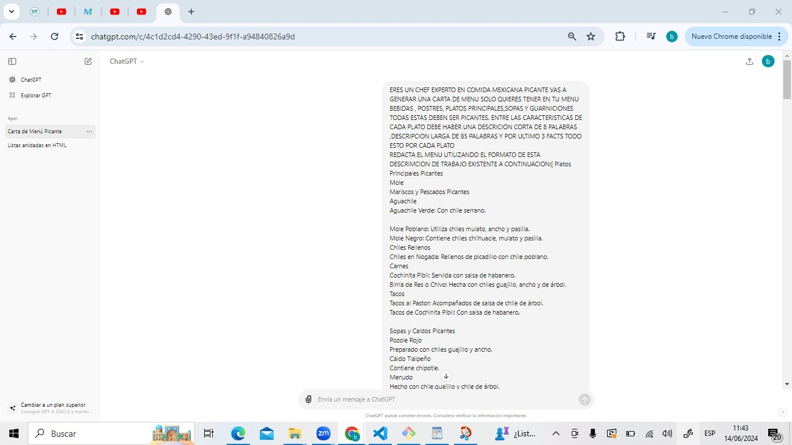
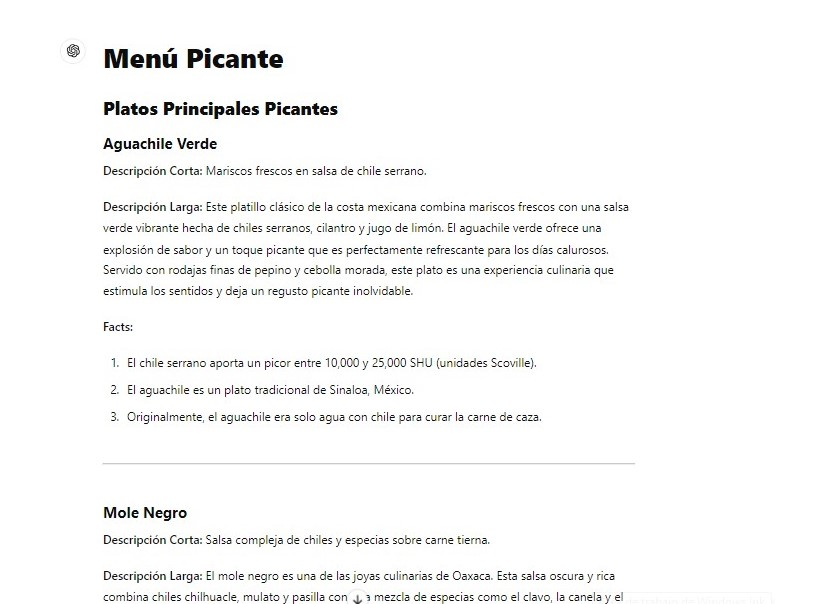

# Indice Dataverse
1. MEXICO PICANTE
2. Resumen del proyecto
3. 🔧 Características-Funcionalidades
4. Historias de Usuario
5.anexo-prompt

## 1. MEXICO PICANTE
Es una web donde encontaras menu Mexicano picante disponible en diferentes niveles de picante ,entre otras caracteristicas de nuestros platillos.

## 2. Resumen del proyecto
Este proyecto es una página web interactiva que permite a los usuarios filtrar y ordenar un menú de comida mexicana. Además, muestra estadísticas relevantes sobre los platillos, como el nivel de picante, el origen, y el tipo de platillo.

## 3. 🔧 Características-Funcionalidades

En la parte superior podras encontar un barra donde podras realizar lo siguiente :
Filtrado: Filtra los platillos por nivel de picante y tipo de platillo.
Ordenamiento: Ordena los platillos por en orden alfabetico 
En la parte inferior podra encontrar
Estadísticas de los platillos disponibles en el menú,en la cual puedes seleccionar que estadisticas deseas.

## 4. Historias de Usuario
Sprint 1
Para generar la data elegimos un tema. -Escribir un prompt para que la IA nos genere la data de acuerdo al tema escogido. -Testear la data generada por la IA para confirmar que cumpla los requisitos. -Editar el prompt según errores arrojados por el test y repetir. 

Sprint 2
Como usuari@s necesitamos que la data se visualice como tarjetas en la página web y que estas tarjetas se adecuen a cualquier tamaño de dispositivo.

Sprint 3
L@s usuari@s necesitamos poder filtrar los datos por tipo de platillo y nivel de picante; y ordenar los datos por orden alfabético por los nombres de los platillos de manera ascendente o descendente.

Sprint 4
L@s usuari@s necesitan ver estadísticas (Datos Curuisos) sobre los platillos, para esto se necesita diseñar el prototipo de alta fidelidad donde se muestre un botón que tenga la función de mostrar y esconder las estadísticas indicadas.

Sprint 5
L@s usuari@s necesitan que los colores sean mas amigables visualmente y no se vea muy recargado la imagen de fondo con las imagenes de las tarjetas.

## 5. anexo-prompt
En los prompt generados para la data con ayuda de IA tuvimos muchas modificaciones aqui mostramos algunas.
  
  
  
